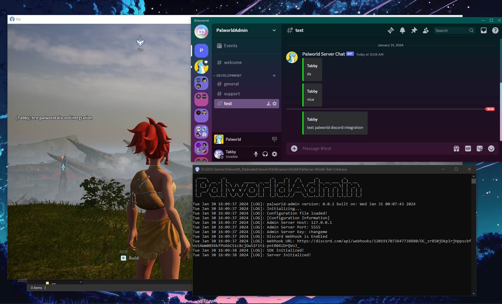

# palworld-admin
The core API for Palworld Server

## Features
1. Discord Webhook integration (WIP)


2. RPC calls to the server (WIP)

## Getting Started
Clone the repo and install dependencies using Visual Studio 2022

Requires the following libs that can be installed using vcpkg
```
1. MinHook used for hooking into the game
2. rpclib used for RPC calls
3. libcurl used for Discord Webhooks
```

Install vcpkg and install the above libs using the following commands
```
vcpkg install minhook:x64-windows-static-md
vcpkg install rpclib:x64-windows-static-md
vcpkg install curl:x64-windows-static-md
```

## Building
Build the project using Visual Studio 2022

## Running
In order to run the project, you will need to copy `palworld-admin.dll` into the server bin directory rename it as `d3d9.dll` and run the game.
It is automatically done by the compile script but you need to modify the directory in the script to match your server directory.

You can modify it in the Visual Studio project:
`palworld-admin` -> `Properties` -> `Build Events` -> `Post-Build Event` -> `Command Line`

The game will load the dll and hook into the game.
